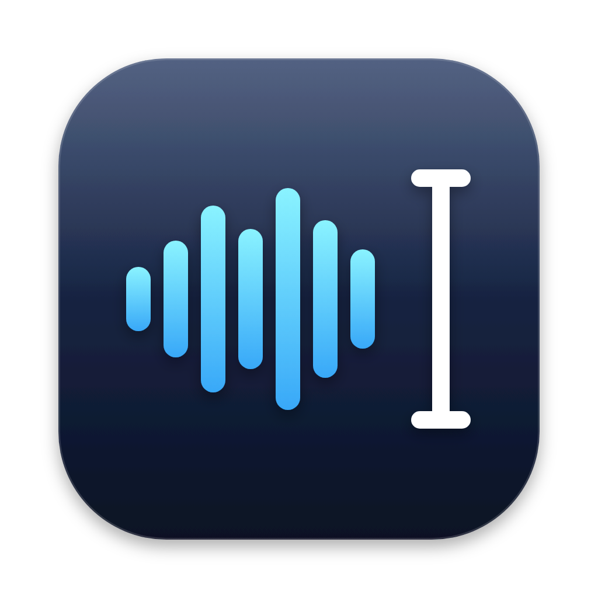

<p align="center">
  
</p>

<h1 align="center">EchoFlow</h1>

<p align="center">Private, on-device dictation for macOS with Apple Speech, Parakeet v3, and Whisper.</p>

<p align="center"><a href="https://github.com/9phfr6dsw4-dotcom/echoflow/releases/latest"><strong>Download the latest release</strong></a> · macOS 26+</p>

## Features

- Dictate with Apple Speech, Parakeet v3, or Whisper large-v3-turbo. Models are installed only when you choose them.
- Use a global hotkey and send finished text to the focused app.
- Review, edit, and copy transcript history stored on your Mac. Customize vocabulary and optional correction learning.
- Optionally pause Music or Spotify while dictating.

## Install

1. Download `EchoFlow.zip` from the [latest release](https://github.com/9phfr6dsw4-dotcom/echoflow/releases/latest) and unzip it.
2. Move **EchoFlow.app** to **Applications before opening it**.
3. Open it once. If macOS blocks it, go to **System Settings → Privacy & Security → Open Anyway**, confirm, then reopen EchoFlow from Applications.
4. Allow microphone access when you start dictation. To use the global hotkey and insert text into other apps, enable EchoFlow in **System Settings → Privacy & Security → Accessibility** when prompted. **Input Monitoring is not required.**
5. If you enable Music or Spotify controls, allow the optional Automation request.

The release is not notarized, so macOS may require approval on first launch.

## Privacy

Speech recognition runs on your Mac. Transcript history, preferences, vocabulary, and learning data stay local. Model and Apple Speech assets download only when you choose to prepare or install them; speech is not sent to a cloud transcription service. Saving audio is optional and off by default.

<details>
<summary>Build and test</summary>

Build and run the tests from the source in this repository:

```sh
swift test
```

</details>
